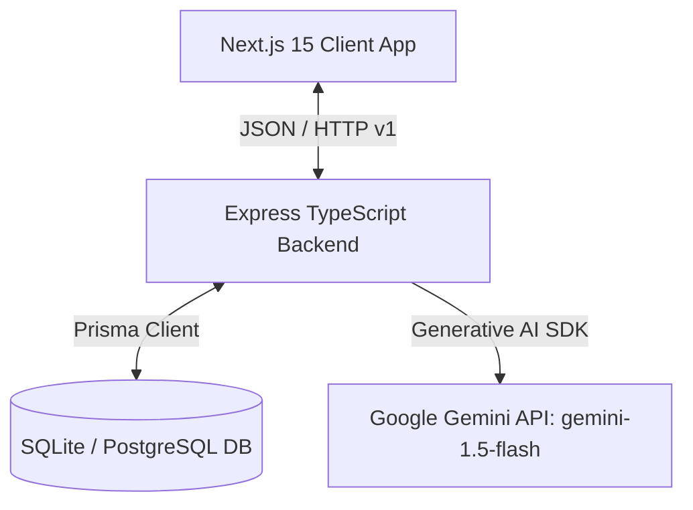
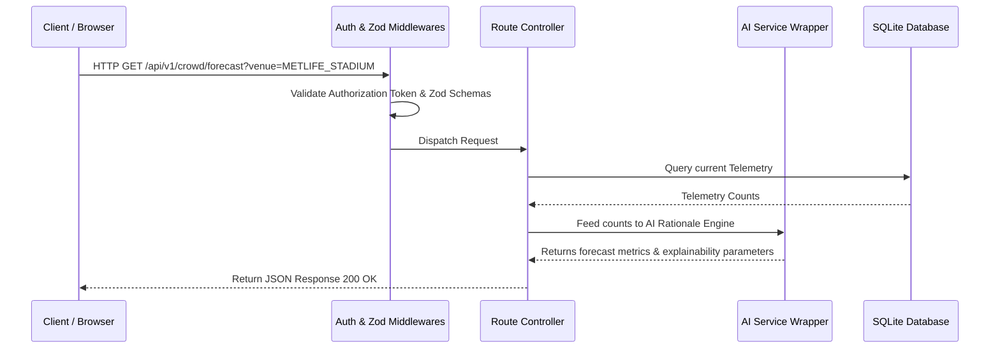
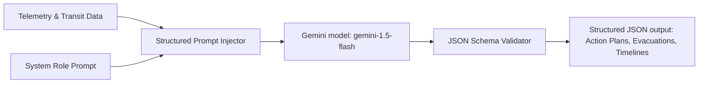
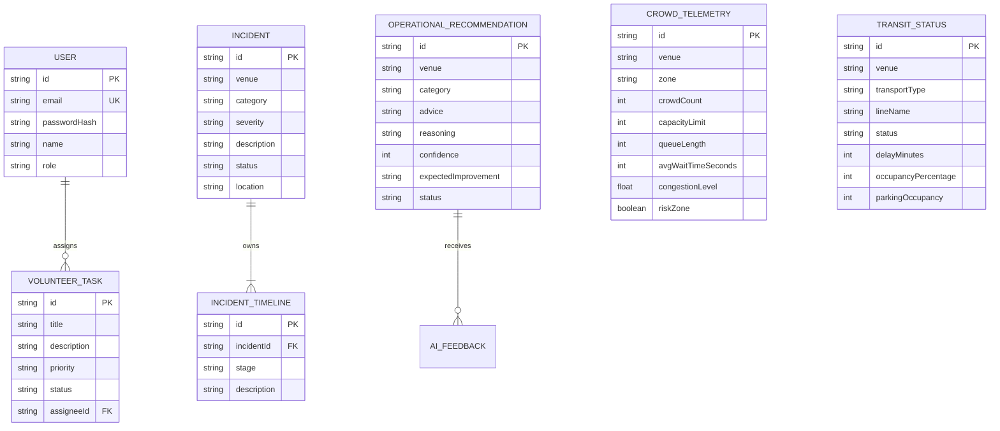
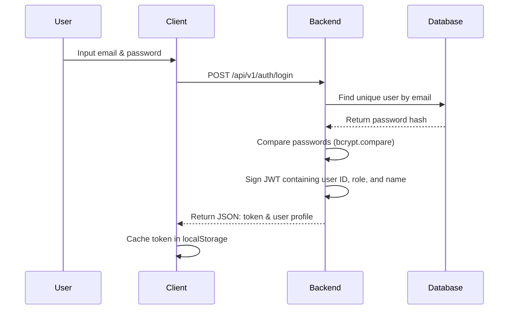
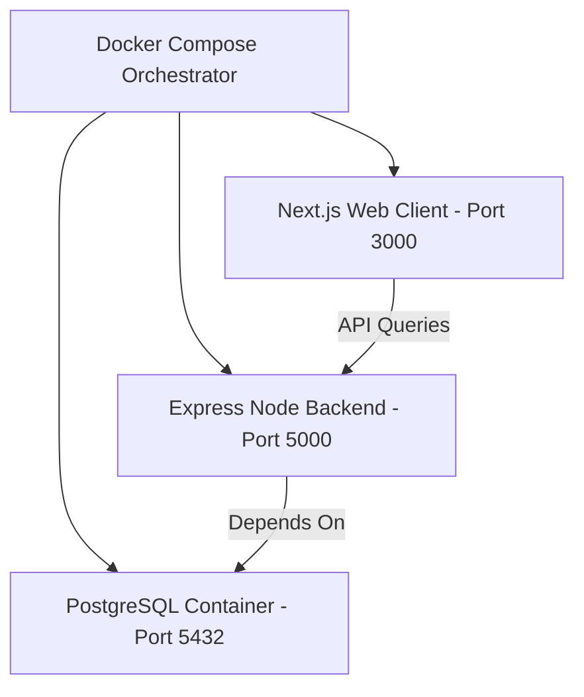

# StadiumIQ AI - FIFA World Cup 2026 Smart Stadium Operations Platform

StadiumIQ AI is a production-grade, tournament-operations suite designed to optimize crowd safety, volunteer logistics, transit coordinates, emergency simulations, and fan experiences across multiple venues for the FIFA World Cup 2026.

---

## 1. System Architecture Diagrams

### 1.1 System Architecture


### 1.2 Request Flow


### 1.3 AI Workflow


### 1.4 Database ER Diagram


### 1.5 Authentication Flow


### 1.6 Deployment Architecture


---

## 2. Folder Structure

```
stadiumiq-ai/
├── .github/
│   └── workflows/
│       └── ci.yml            # GitHub Actions Pipeline
├── backend/
│   ├── prisma/
│   │   ├── schema.prisma     # Prisma Schemas
│   │   └── seed.ts           # World Cup Seeding Data
│   ├── src/
│   │   ├── controllers/      # Route controllers (SOLID architecture)
│   │   ├── middlewares/      # JWT, security rate limiters, validation
│   │   ├── routes/           # Express endpoint router definitions
│   │   ├── services/         # Gemini AI Service wrapper
│   │   └── app.ts            # Server entry point
│   ├── tests/                # Vitest backend integration tests
│   ├── Dockerfile
│   └── tsconfig.json
├── frontend/
│   ├── src/
│   │   ├── app/              # Next.js 15 pages and layouts
│   │   ├── context/          # State Providers (Auth, Accessibility, Stadium)
│   │   └── globals.css       # Global design tokens
│   ├── Dockerfile
│   └── tsconfig.json
├── docs/                     # Detailed architectural spec folders
│   ├── architecture.md
│   ├── api.md
│   ├── ai-prompts.md
│   ├── deployment.md
│   ├── testing.md
│   ├── accessibility.md
│   └── security.md
├── docker-compose.yml        # Multi-container config
└── package.json              # Monorepo scripts
```

---

## 3. Installation & Getting Started

### 3.1 Zero-Configuration Dev Mode (Local SQLite)
If Docker is not immediately running on your machine, you can run the platform locally using SQLite:

1. **Install workspace dependencies**:
   ```bash
   npm run install:all
   ```
2. **Setup the database and migrations**:
   ```bash
   cd backend
   npx prisma migrate dev --name init
   npm run db:seed
   ```
3. **Launch the development server**:
   ```bash
   cd ..
   npm run dev
   ```
   * Access Frontend: `http://localhost:3000`
   * Access Backend API: `http://localhost:5000/api/v1`

---

## 4. Multi-Profile Environment Settings
The application loads configurations based on active node profiles:
* `.env.development`: Connects to local SQLite `dev.db` database.
* `.env.test`: Connects to `test.db` database context for isolated testing.
* `.env.production`: Configured to connect to the PostgreSQL Docker instance.

---

## 5. Security & Accessibility Audits

### 5.1 Security
- **Data Protection**: Cryptographically hashes passwords using `bcryptjs`.
- **JWT authorization**: Route guards inspect signed role claims (`ORGANIZER`, `SECURITY_OFFICER`, etc.) to prevent cross-account API escalation.
- **Express rate-limiters**: Enforce requests caps protecting AI tokens.
- **Helmet headers**: Blocks clickjacking and frames script injections.

### 5.2 Accessibility compliance (WCAG 2.2)
- **High Contrast**: Custom stylesheet overrides background/foreground colors.
- **Font Resizing**: Exposes state scaling parameters up to 200%.
- **Keyboard navigation**: Implements visible outlines on focus and tab indexes.
- **Aria Live announcements**: Hidden logs announce updates for screen readers.

---

## 6. Testing Guide
Verify application features by executing tests:
* **Backend API tests**:
  ```bash
  cd backend
  npm run test
  ```

---

## 7. License & Contributors
* **License**: MIT Enterprise License
* **Team**: FIFA 2026 Stadium Logistical Operations Team
