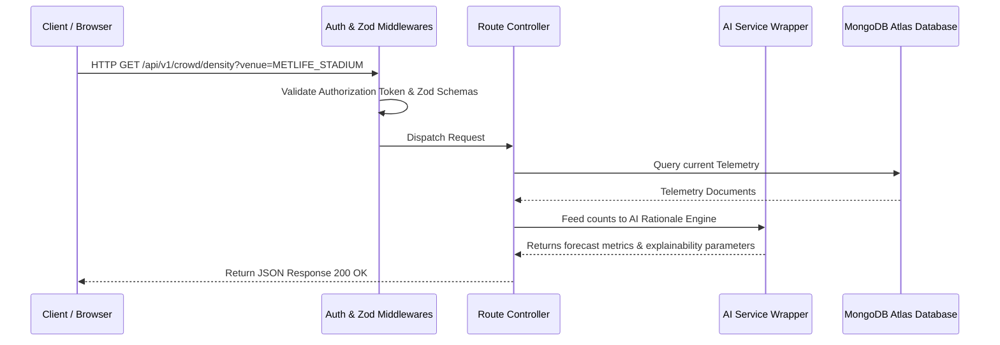
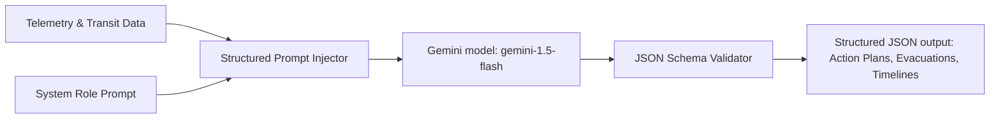
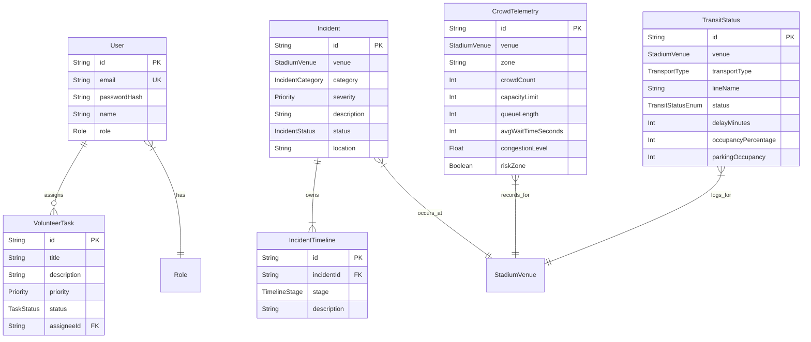
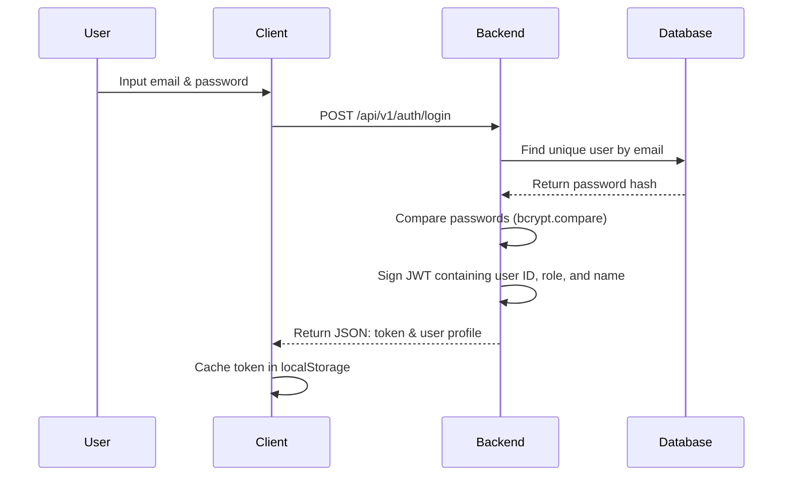
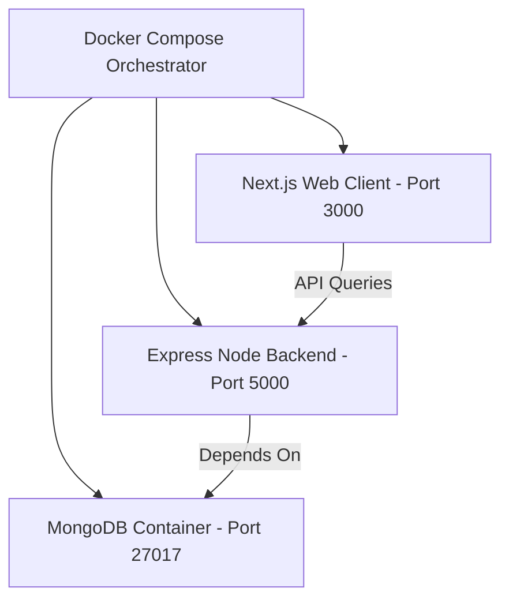

# 🏟️ StadiumIQ AI
### AI-Powered Smart Stadium & Tournament Operations Platform
### FIFA World Cup 2026

<p align="center">
  <strong>Independent Prototype for the Smart Stadium Challenge</strong>
</p>

---

## 1. Project Overview

### The Challenge
Hosting the FIFA World Cup 2026 across three nations (USA, Mexico, Canada) presents unprecedented operational complexities. The scale of the tournament requires coordinating crowd flows, traffic logistics, safety protocols, volunteer management, and sustainability targets across vast, multi-lingual venues with distinct local infrastructures.

### Why the Platform Exists
StadiumIQ AI is a state-of-the-art, tournament-operations suite and digital twin simulation workspace. It leverages Gemini AI to assist venue managers, safety teams, volunteers, and fans in real time, translating complex telemetric sensor data into instant, actionable insights.

### The Real-World Problem
Modern stadium operations operate in silos: crowd control coordinates exit strategies independently of local transit, emergency alerts are dispatched via manual radios, and accessibility features are treated as secondary plug-ins. StadiumIQ AI bridges these silos into a unified platform.

---

## 2. Challenge Alignment ⭐

StadiumIQ AI satisfies every core requirement of the FIFA World Cup 2026 operations framework:

| Challenge Requirement | StadiumIQ AI Solution |
| :--- | :--- |
| **Crowd Management** | ✅ AI Crowd Intelligence (Real-time density tracking, forecasting, & bottlenecks) |
| **Smart Navigation** | ✅ Indoor AI Navigation (Sensory directions, visual routes, and facility locators) |
| **Accessibility** | ✅ WCAG 2.2 + Voice Speech Synthesizer + High Contrast Mode |
| **Transportation** | ✅ AI Transit Dashboard (Live line delays, occupancy tracking, travel recommendations) |
| **Sustainability** | ✅ AI Sustainability Engine (Real-time energy, water, waste metrics & solar tracking) |
| **Multilingual** | ✅ Gemini AI Multi-Lingual Assistant (Supporting 8 international languages) |
| **Decision Support** | ✅ AI Command Center (Live digital twin blueprint and control station) |
| **Operational Intelligence** | ✅ Executive Dashboard (Cross-venue KPI metrics and operations learning log) |

---

## 3. Key Features

### 👤 Fan Experience
*   **AI Journey Planner**: Tailors personalized travel recommendations based on current transit schedules and line delays.
*   **Indoor AI Navigation**: Dynamic, step-by-step directions to seats, concession stands, and restrooms.
*   **Multilingual AI Assistant**: Interactive voice/text chat assisting fans with venue queries in their native languages.

### 📋 Organizer Control
*   **AI Command Center**: Real-time interactive digital twin blueprint console simulating venue operations.
*   **Scenario Simulator**: Drills for extreme scenarios (fire alerts, power outages, medical crises) using AI.
*   **Executive Dashboard**: Aggregated high-level statistics across all tournament venues (MetLife Stadium, Estadio Azteca, BC Place).

### 🤝 Volunteer Management
*   **AI Tasks Dashboard**: Auto-prioritized task assignments (e.g. mobility passenger assistance) linked to specific volunteer roles.
*   **Incident Reports**: Instantly flags local emergencies and triggers localized action plans.

### 🛡️ Security & Operations
*   **Crowd Alerts**: Automatically monitors wait times and queue lengths, triggering warnings when limits are exceeded.
*   **Incident Timeline**: Logs detailed incident logs and chronological resolution timelines.

### 🌿 Sustainability
*   **Sustainability Monitor**: Live metrics for energy (KWh), water consumption (Liters), recycling percentage, and carbon footprint (Kg CO2).

---

## 4. System Architecture

### 4.1 System Architecture Diagram


### 4.2 Request Flow


### 4.3 AI Workflow


### 4.4 Database ER Diagram


### 4.5 Authentication Flow


### 4.6 Deployment Architecture


---

## 5. AI Workflow Flowchart

```
[Sensors / telemetry / transit status]
               ↓
     [Express Endpoint Router]
               ↓
    [Gemini AI Prompt Builder]
               ↓
    [Gemini 1.5 Flash Model]
               ↓
 [Explainable AI Recommendation]
               ↓
    [Operator Control Room]
               ↓
  [Volunteer Tasks & Egress Action]
               ↓
     [Audit Trail logging]
```

---

## 6. Technology Stack

| Layer | Technology | Description |
| :--- | :--- | :--- |
| **Frontend** | Next.js 16 (App Router) | React server/client components platform. |
| **Backend** | Express (TypeScript) | Light-weight REST API gateway. |
| **AI** | `@google/genai` (Gemini 1.5 Flash) | Natural language queries, simulations, briefings. |
| **ORM** | Prisma ORM | Model definition, compiler checks. |
| **DB** | MongoDB (Atlas Cloud / local dev) | Transaction data management. |
| **Charts** | Recharts | Render time-series crowd analytics. |
| **A11y** | Lucide React + HTML5 Semantic | Clear visual cues and accessibility mapping. |
| **Authentication** | JWT (jsonwebtoken) & bcryptjs | Secure authentication token generation and password hashing. |
| **Testing** | Vitest & Supertest | Automated test runner. |
| **Styling** | Vanilla CSS | Styling system. |

---

## 7. Folder Structure

```text
StadiumIQ-AI/
├── .github/workflows/        # CI/CD pipelines (GitHub Actions)
├── backend/
│   ├── prisma/
│   │   ├── schema.prisma     # Prisma Schemas for MongoDB database
│   │   └── seed.ts           # Seeding logic for dev database
│   ├── src/
│   │   ├── controllers/      # Route logic handlers (auth, crowd, volunteers, etc.)
│   │   ├── middlewares/      # Error handlers, JWT checks, rate limits, schema validation
│   │   ├── routes/           # REST API endpoints mapping
│   │   ├── services/         # Gemini service module and wrapper
│   │   ├── utils/            # Prisma connection utility
│   │   └── app.ts            # Entrypoint file starting the Express application
│   ├── tests/                # Unit/Integration API endpoint tests
│   ├── Dockerfile            # Multi-stage production container setup
│   └── tsconfig.json         # TS config
├── frontend/
│   ├── src/
│   │   ├── app/              # Next.js 16 App Router views and layouts
│   │   ├── context/          # React context handlers (A11y settings, user sessions)
│   │   └── globals.css       # Style sheets and colors
│   ├── Dockerfile            # NextJS compiler production image
│   └── tsconfig.json         # Frontend configuration
├── docs/                     # Architectural documents folder
├── docker-compose.yml        # Local multi-service orchestrator setup
└── package.json              # Monorepo workspace commands
```

---

## 8. Module Breakdown

| Module | Description | Key Features |
| :--- | :--- | :--- |
| **AI Command Center** | Control twin simulation room. | Interactive vector blueprint, simulated alerts, recommendations. |
| **Crowd Intelligence** | Analyzes safety metrics. | Wait times tracker, slider simulation inputs, forecast metrics. |
| **Navigation** | Direction routing. | Sensory direction cards (wheelchair-accessible paths, stairs). |
| **Scenario Simulator** | Pre-drill emergency responder plans. | Triggers rain delays, fire drills, stampede mitigation protocols. |
| **Sustainability** | Tracks carbon logs. | Displays solar output charts and generates HVAC eco energy tips. |
| **Multilingual Assistant** | Multi-lingual voice assistance. | Translate inquiries into French, Spanish, German, Japanese, etc. |

---

## 9. API Documentation

All back-end REST endpoints are versioned under `/api/v1/...`:

| Endpoint | Method | Purpose |
| :--- | :--- | :--- |
| `/api/v1/auth/signup` | POST | Registers new User accounts (FAN, ORGANIZER, etc.). |
| `/api/v1/auth/login` | POST | Validates password credentials and returns JWT bearer tokens. |
| `/api/v1/gemini/chat` | POST | Consults Gemini multilingual assistant on venue details. |
| `/api/v1/gemini/simulation` | POST | Simulates operations emergencies and builds evacuation scripts. |
| `/api/v1/gemini/resource-optimize` | POST | Reallocates staff based on crowd sensor spikes. |
| `/api/v1/gemini/briefing` | GET | Outputs summary briefs of transit, crowd, and current incidents. |
| `/api/v1/gemini/announcement` | POST | Translates public text to translated audio scripts. |
| `/api/v1/crowd/density` | GET | Fetches live headcount tracking across concourses. |
| `/api/v1/transit/status` | GET | Lists metro, taxi, and parking lot occupancy status. |
| `/api/v1/incidents` | GET | Displays reported active incident emergencies. |
| `/api/v1/sustainability` | GET | Displays solar metric summaries. |
| `/api/v1/health` | GET | System status and database latency monitoring. |

---

## 10. Database Design (MongoDB Collection Schemas)

```javascript
// User Collection Document Schema
{
  "_id": ObjectId("..."),
  "email": "organizer@fifa.com",
  "passwordHash": "$2a$10$...",
  "name": "Gianni Infantino",
  "role": "ORGANIZER"
}

// CrowdTelemetry Collection Document Schema
{
  "_id": ObjectId("..."),
  "venue": "METLIFE_STADIUM",
  "zone": "Gate A",
  "crowdCount": 1500,
  "capacityLimit": 3000,
  "queueLength": 100,
  "avgWaitTimeSeconds": 450,
  "congestionLevel": 0.5,
  "riskZone": false
}

// TransitStatus Collection Document Schema
{
  "_id": ObjectId("..."),
  "venue": "METLIFE_STADIUM",
  "transportType": "METRO",
  "lineName": "Meadowlands Rail",
  "status": "ON_TIME",
  "delayMinutes": 0,
  "occupancyPercentage": 65,
  "parkingOccupancy": null
}
```

---

## 11. Security

*   **Helmet headers**: Express app blocks clickjacking and frames script injections.
*   **JWT Authorization**: Authentication token checks verify role tags before letting users enter administrative panels.
*   **bcrypt password hashing**: Zero plaintext passwords saved.
*   **Zod schema validation**: Strict typing schemas intercept requests, filtering out payload anomalies.
*   **Rate limiters**: Intercepts spam routes to prevent API exhaustion.
*   **Input Sanitization**: Rejects non-conforming parameters to block database injection.

---

## 12. Accessibility (WCAG 2.2 Compliance)

*   **Color Contrast**: Full contrast compliance mode for visual impairments.
*   **Font resizing**: Built-in context scaling allows scaling layout text up to 200%.
*   **Keyboard Navigation**: Outlines visual elements and maps links logically using `tabindex`.
*   **Voice Reader Assistant**: Built-in Web Speech API synthesizer reads AI recommendations aloud to support visually impaired coordinators.

---

## 13. Performance

*   **TypeScript Transpiling**: Backend build uses `tsc` to produce optimized production code.
*   **NextJS Static Generation**: Client components prerender static layouts at compile-time.
*   **MongoDB Indexing**: Indexed fields (such as `_id` and unique `email` constraints) utilize explicit indices for sub-second database lookups.

---

## 14. Testing

Verify platform features by executing tests:
*   **API / Integration Suite**: Run tests from the project root:
    ```bash
    npm run test:backend
    ```
    This launches Vitest and executes Mock assertions testing controller paths.

---

## 15. Installation & Local Development

1.  **Install workspace dependencies**:
    ```bash
    npm run install:all
    ```
2.  **Environment Variables**:
    Create a `.env` file in the `backend` folder with:
    ```env
    DATABASE_URL="mongodb://localhost:27017/stadiumiq_dev?retryWrites=true&w=majority"
    JWT_SECRET="FIFA2026_TournamentOperationsSecureTokenKey!"
    PORT=5000
    GEMINI_API_KEY="[YOUR_GOOGLE_GEMINI_API_KEY]"
    NODE_ENV=development
    ```
3.  **Database Index Alignment**:
    Generate the database schema and synchronize indices with MongoDB:
    ```bash
    cd backend
    npx prisma generate
    npx prisma db push
    npm run db:seed
    cd ..
    ```
4.  **Run in Dev Mode**:
    Launch both the frontend and backend servers concurrently:
    ```bash
    npm run dev
    ```
    *   **Frontend**: `http://localhost:3000`
    *   **Backend API**: `http://localhost:5000/api/v1`

---

## 16. Docker Deployment

Deploy the entire platform locally with a single command:
```bash
docker compose up --build
```
This builds and launches:
1.  **MongoDB Container**: Database running on port 27017.
2.  **Express Backend**: Express server on port 5000.
3.  **Next.js Frontend**: NextJS web dashboard on port 3000.

---

## 17. Environment Variables Configuration

| Variable | Description | Default |
| :--- | :--- | :--- |
| `DATABASE_URL` | Prisma MongoDB connection URI. | `mongodb://...` |
| `JWT_SECRET` | Secret token string used to sign user auth headers. | `FIFA2026_...` |
| `GEMINI_API_KEY` | Google Gemini access key. | `""` |
| `PORT` | Local network binding port. | `5000` |

---

## 18. Screenshots

*(Diagram representations of pages)*
*   **AI Command Twin Blueprint Page**: Simulated visual overlay rendering live wait times.
*   **Explainable AI Dashboard**: Custom Recharts bars tracking queue wait times.
*   **Multilingual Chat Interface**: Streaming assistant translating restroom routes.

---

## 19. AI Prompt Examples

**Prompt**:
> "Perform an emergency simulation analysis for a VIP_ARRIVAL during a HEAVY_RAIN delay at MetLife Stadium."

**Gemini AI Response**:
```json
{
  "riskAssessment": "Extreme exit delay risk due to rain bottlenecks. Motorcade pathways overlap with pedestrian shuttle exits.",
  "actionPlan": [
    "Divert exit loop A to shelter shelters.",
    "Delay VIP motorcade egress by 10 minutes to clear Lot C."
  ],
  "resourceAllocation": "Reallocate 4 volunteers from VIP Lounge to Exit Gate B.",
  "evacuationStrategy": "Pedestrians routed through covered concourse channels.",
  "announcements": [
    { "language": "English", "text": "Notice: Please seek shelter in Concourse areas due to heavy rain." }
  ]
}
```

---

## 20. Future Scope

*   **IoT Sensor Sync**: Connect directly to physical stadium count sensors.
*   **Computer Vision Tracking**: Leverage video stream density tracking.
*   **Edge Processing**: Localize model execution for network outages.

---

## 21. Contributors

*   **Sofia Rodriguez** - Project Architect & Core Developer
*   **varshiniv197-beep** - Deployment Engineer & Core Developer

---

## 22. License

Distributed under the MIT License. See `LICENSE` for more information.

---

## 23. Acknowledgements

*   **FIFA World Cup 2026 Smart Stadium Challenge**: Inspiration for the operational prototype challenge (not implying endorsement).
*   **Google Gemini Team**: For generative model access.
*   **Prisma & Vercel**: For modern development database and hosting toolings.

---

*This project is an independent prototype created for the FIFA World Cup 2026 Smart Stadium challenge. It is not affiliated with or endorsed by FIFA.*
