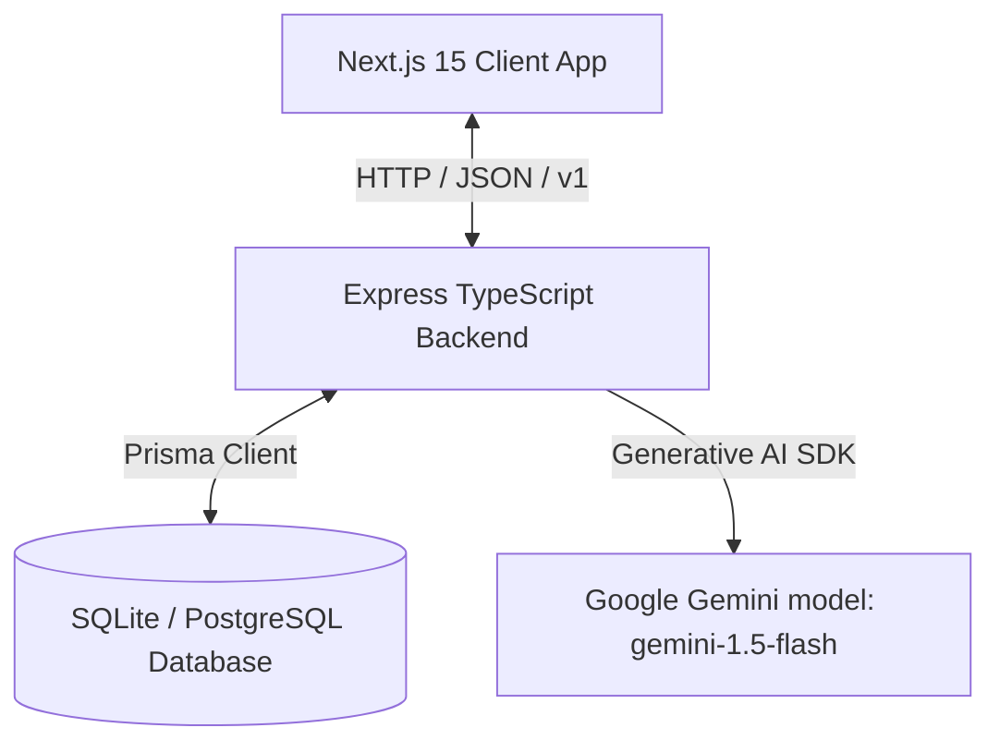

# StadiumIQ AI - System Architecture

StadiumIQ AI is designed as a modular, containerized enterprise SaaS application for managing FIFA World Cup 2026 stadium logistics, security, transit, and fan navigation. This document details the architectural guidelines, flow structures, and layout designs implemented in the codebase.

---

## High-Level Architectural Design

### 1. Frontend Architecture (Client Layer)
The Next.js 15 web application uses the React 19 App Router and TypeScript. Key aspects include:
- **State Management**: Implemented using React Context providers. We declare providers for:
  - `AuthContext`: Manages JWT tokens, session logins, and profile details.
  - `AccessibilityContext`: Manages High Contrast theme overrides, text scaling, speech Synthesis, and keyboard focus control.
  - `StadiumContext`: Dynamic venue context (switching between MetLife Stadium, Estadio Azteca, and BC Place) and polling state intervals for alerts and telemetry updates.
- **Component Styling**: Crafted using vanilla Tailwind CSS with curated gold, forest green, and slate color systems reminiscent of official FIFA branding. 
- **Interactive Layers**: 
  - **Leaflet Maps**: Custom SVG overlay maps showing gate coordinates, volunteer coordinates, and emergency evacuation vectors.
  - **Framer Motion**: Micro-interactions, slide-out dashboards, alert overlays, and chat message streams.
  - **Recharts**: Data visualization layer showing 60-minute crowd forecasting, carbon usage index, and transport schedules.

### 2. Backend Architecture (API Service Layer)
The Express backend separates concerns using clean architecture principles:
- **Routes Layer**: Standardizes endpoints under `/api/v1/...`. Leverages validation middleware to filter payloads before routing controllers.
- **Controller Layer**: Inspects incoming request schemas, handles authentication contexts, and dispatches data actions to appropriate service managers. Does not contain raw SQL/Prisma operations.
- **Service Layer**: Manages external data requests. Highlights:
  - `GeminiService`: Manages connection to the Google GenAI SDK. Pre-defines system prompts and schemas for structured JSON generations, and implements fully functional mock generators if the API key fails.
- **Database Layer**: Prisma ORM abstraction mapping SQLite locally and Postgres in production.

---

## Structured Flow Controls

### 1. AI Scenario Simulator Flow
When an organizer triggers a crisis simulation:
1. **Request Ingestion**: Controller verifies caller credentials (must be `ORGANIZER` or `SECURITY_OFFICER`).
2. **Telemetry Pull**: Current crowd and transport counts are queried from the database.
3. **Gemini Dispatch**: Telemetry + Scenario details are sent to Gemini requesting a structured JSON evacuation strategy, action checklist, and announcements.
4. **Operations Trigger**: Alert entries are appended to the DB to notify volunteers and security. The scenario logs are stored in `LearningLog` for post-simulation analytics.
5. **UI Update**: Client polls database modifications and overrides the map canvas showing emergency evacuation overlays.

### 2. Explainable AI (XAI) Verification Flow
To establish trust in automated operational recommendations:
1. Every recommendation is written with structured weights representing crowd counts, queue trends, weather inputs, and transit delays.
2. The UI renders this inside the **"Why AI Suggested This"** panel, displaying:
  - **Confidence Gauge**: Progress bar indicating predictive certainty.
  - **Expected Outcome**: Quantitative impact estimates (e.g. "Cut queue delay by 18%").
  - **Contributing Criteria**: Breakdown of weight parameters.
